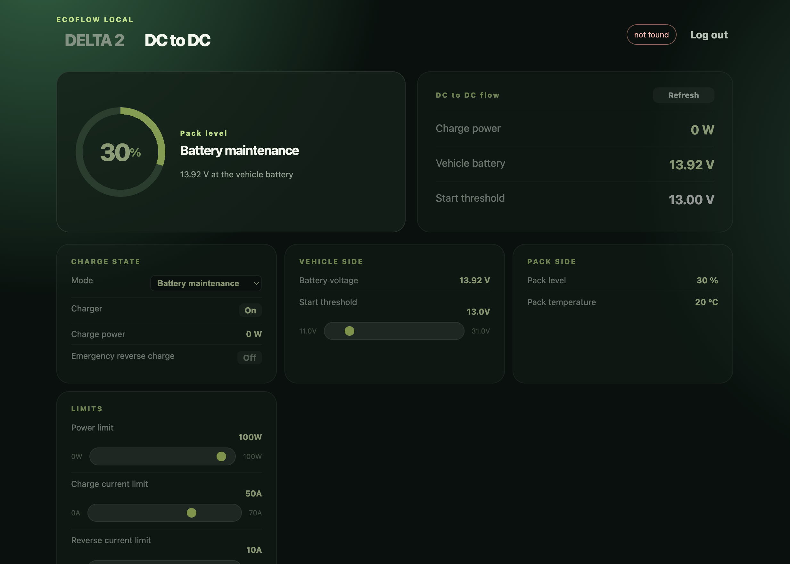

# EF BLE Dashboard

[](https://github.com/Fildes3d3/ef-ble-dashboard/actions/workflows/checks.yml)

A local-first dashboard for the EcoFlow DELTA 2 (with its extra batteries) and the Alternator Charger, read and controlled over Bluetooth LE. No cloud connection at runtime, no vendor app, no data leaving your network.



The dashboard has its own password form; it never collects or stores an EcoFlow email address or password.

Sign-in is rate limited: five wrong passwords are tolerated, after which the source is
locked out for a period that doubles with each further attempt, up to an hour. The
correct password is refused during a lockout too, so it cannot be used to confirm a
guess. Behind a reverse proxy, configure the proxy and Uvicorn's
`--forwarded-allow-ips` together - the guard keys on the immediate peer, and without
that every visitor shares one bucket.

It does not only read: on the DELTA 2 it can switch the AC outlets, USB ports and 12V port, turn AC charging on or off and set its speed, and change the charge limits and energy backup; on the Alternator Charger it can change all seven settings. Grid bypass stays read-only. Anyone who knows the dashboard password can therefore switch power and change charging in the van, so choose a strong one and keep the service on a trusted network.

## Architecture

Run this service on a Mac mini, Raspberry Pi, or another computer **inside Bluetooth range of the DELTA 2**. It reads telemetry locally and serves the dashboard on the van Wi-Fi network.

```
DELTA 2  ← Bluetooth LE →  local gateway + dashboard  ← Wi-Fi → phone/tablet
```

A personal server on the internet cannot read the DELTA's Bluetooth directly. A later optional relay can securely copy selected telemetry from this local gateway to that server, while preserving this local BLE mode.

## Install

Requires Python 3.13 or newer.

```sh
git clone https://github.com/Fildes3d3/ef-ble-dashboard.git
cd ef-ble-dashboard
python3.13 -m venv .venv
.venv/bin/pip install -r requirements.txt
bash scripts/bootstrap_eflib.sh
cp .env.example .env
python scripts/generate_secret.py
```

To run the tests and linter as well:

```sh
.venv/bin/pip install -r requirements-dev.txt
bash scripts/check.sh
```

Set the printed random value as `APP_SESSION_SECRET` in `.env`. Leaving it empty makes every login fail with a 503, because the dashboard refuses to issue session cookies it cannot sign. Choose a distinct `APP_ADMIN_PASSWORD`. Set `ECOFLOW_USER_ID` to your numeric EcoFlow User ID (see below). The collector finds each unit by the serial number in its Bluetooth advertisement rather than by name, so renaming a device in the EcoFlow app will not break discovery. DELTA 2 serials begin `R331` or `R335`; the Alternator Charger's begin `F371`, `F372` or `DC01`. Nothing about your particular units needs to go in `.env`.

### Getting your EcoFlow User ID

The units only accept a Bluetooth connection authenticated with the numeric User ID of the EcoFlow account they are bound to, so each unit must first be bound to your account in the EcoFlow app.

This project does not fetch the User ID for you, and never asks for your EcoFlow password. The upstream [ha-ef-ble](https://github.com/rabits/ha-ef-ble) Home Assistant integration can retrieve it through its login form during setup. However you obtain it, don't hand your EcoFlow credentials to a tool or site you don't trust.

## Start the server

### On macOS, use the launcher app

macOS refuses Bluetooth to any process whose *responsible application* does not
declare `NSBluetoothAlwaysUsageDescription` in its `Info.plist`, and kills that
process with `SIGABRT` the moment it touches CoreBluetooth. Neither Homebrew's
`python` nor `Terminal.app` declares that key, so starting `uvicorn` straight
from a shell crashes as soon as the collector scans. Build the launcher once:

```sh
bash scripts/make_launcher.sh
```

`scripts/make_launcher.sh` builds two apps in `tools/`:

- **EcoFlow Dashboard.app** - the one to click. It starts the service if it is not
  already running, waits for it, and opens the dashboard in your browser. Clicking it
  again when the service is up just opens the page; it never starts a second copy. If
  the service fails to come up it shows a notification and opens the log.
- **EcoFlow Gateway.app** - the service itself. No window and no Dock icon, since it
  only serves HTTP. Started for you by the Dashboard app or the LaunchAgent; there is
  rarely a reason to open it directly.

The bundle becomes the responsible app, and the `uvicorn` process it spawns
inherits the Bluetooth grant. macOS asks for Bluetooth permission the first time;
approve it. Server output goes to `data/gateway.log`. Stop it with
`pkill -f "uvicorn app.main:app"`.

### Keeping it running

The gateway is started by hand: open **EcoFlow Dashboard.app**. Nothing restarts it
automatically, which is deliberate - it runs when you ask it to.

If you later want it always on (the right choice for a gateway wired into a van),
`bash scripts/install_launchagent.sh` installs a LaunchAgent that starts it at login and
restarts it within 30 seconds if it exits. Undo that with:

```sh
launchctl bootout gui/$UID/local.ecoflow.gateway
rm ~/Library/LaunchAgents/local.ecoflow.gateway.plist
```

What survives what, as it stands now:

| Event | Result |
| --- | --- |
| System sleeps and wakes | Process survives. The first cycle after wake finds the cached Bluetooth handle stale, drops it, rescans, and carries on. |
| App quit, crash, or kill | Stays down until you open the Dashboard app again. |
| Reboot or power loss | Stays down until you open the Dashboard app again. |
| Gateway machine off | Nothing is recorded. The gap is a gap; readings resume on return. |

A gap in the history is harmless - the charts break the line rather than drawing a false
zero through it, and nothing backfills a period nobody observed.

### On Linux (Raspberry Pi and similar)

No launcher is needed:

```sh
.venv/bin/uvicorn app.main:app --host 0.0.0.0 --port 8080
```

The app reads `.env` itself on startup, so sourcing it first is optional.
Real environment variables always win over the file.

Open `http://localhost:8080` on the gateway, or `http://<gateway-lan-address>:8080` from a device on the same van Wi-Fi. Set `APP_COOKIE_SECURE=true` only after placing it behind HTTPS (for example, Caddy or Nginx with a trusted certificate).

## Devices

The dashboard has a tab per unit, both read over the same Bluetooth radio:

- **DELTA 2** - full telemetry, three switchable ports, and its charging settings:
  AC charging on/off, AC charge speed, the two charge limits, energy backup and its
  reserve level. The charge limits bound each other - the low slider stops at whatever
  the high one is set to, and vice versa - so the pair can never cross.
- **DC to DC** - the Alternator Charger (serials `F371`, `F372`, `DC01`), fully writable:
  charger on/off, mode, emergency reverse charging, and four adjustable values - power
  limit, start threshold, charge current limit and reverse current limit.

Adjustable values are sliders bounded by the limits the unit itself reports
(`power_max`, `start_voltage_min`/`max`, `charging_current_max`,
`reverse_charging_current_max`), so the range on screen is always the real one rather than
a hardcoded guess. The slider tracks while dragging and only sends on release, so one
adjustment costs one BLE command instead of dozens. Those reported ceilings are no longer
listed as separate rows: the slider already shows them at either end.

`dc_power` on the charger is **bidirectional**. Positive means the alternator is charging
the DELTA 2; negative means the charger is pushing power the other way, topping up the
vehicle's starter battery from the DELTA 2. In Battery maintenance mode with the charger
enabled and the engine off, expect a negative figure - between -26 and -44 W observed on this
van, matching the DELTA 2's own reported output at the same moment. The charts scale across
the full range with a dashed zero line so the direction is visible.

Every BLE operation is capped (20s for a command, 120s overall). Without that a write whose
acknowledgement never arrives hangs forever holding the shared radio lock, which freezes
*every* device rather than just the one being commanded.

Units are told apart by the serial number in their BLE advertisement, which the library
maps to a device class. Nothing about the device name or address needs configuring, and
renaming a unit in the EcoFlow app cannot confuse it.

Only one BLE connection is possible at a time, so the collectors share a lock and are
polled in turn, never in parallel. A unit that is not answering backs off exponentially
(one poll interval, then two, four, and so on up to five minutes) rather than spending a
10-second scan on it every cycle - an alternator that only wakes with the engine running
therefore costs almost nothing while it is asleep.

Each device writes to its own table (`snapshots`, `alternator_snapshots`) whose schema is
derived from its own dataclass, so adding a field or a device does not disturb the other.

### A note on the XT150 port

The alternator charger and an extra battery share the XT150 port, and the DELTA 2 reports
whatever is plugged in there through its `battery_1_*` fields. With the charger connected,
`battery_1_enabled` reads true and `battery_1_sn` carries an `F371` serial - the charger's,
not a battery's - while every cell and voltage field stays empty. That is why the dashboard
trusts `battery_N_attached`, which the collector derives from actual reported values,
rather than the raw flag.

## What it reads

The collector samples locally every 15 seconds by default: it connects to the DELTA 2, collects authenticated telemetry, and then disconnects. Bluetooth discovery costs a fixed 10 seconds, so the device handle is kept after the first successful connection and reused; a stale handle (the unit slept, moved out of range, or the OS dropped it) falls back to one full scan automatically. That takes a cycle from about 38 seconds to about 18. Commands go through `POST /api/control/{name}` with a `{"value": ...}` body. The endpoint
rejects any name that is not a declared control with a 404, and an out-of-range value with a
400 - checked against the last reading first, so a bad value fails instantly instead of
costing a 20-second Bluetooth connection. Writable: the DELTA 2's three ports, AC charging and
its speed, the two charge limits, energy backup and its reserve level, and all seven of the alternator's settings. Grid bypass stays read-only: the library ships it disabled, and its inverted sense makes a mis-click easy to misread. After sending a switch command the collector waits for the unit to report the new state before answering, so the dashboard shows what the DELTA 2 actually did rather than what it was asked to do.

It records every value the unit reports - 51 fields per reading, of which about 43 are populated on this hardware:

- **Charge and health** - battery level (system and main pack), pack voltage, cell temperature, highest/lowest cell voltage (the dashboard derives cell imbalance in mV from the last two).
- **Totals** - all input watts, output watts, solar/XT60 watts.
- **AC** - input and output watts, voltage and current.
- **DC** - solar/XT60 voltage and current, 12V rail voltage and current, 12V/car output watts.
- **Per port** - USB-C 1/2, USB-A 1/2, fast-charge USB-A 1/2, AC outlets, 12V.
- **Switch states** - AC outlets, USB ports, 12V port, grid bypass.
- **Charging configuration** - AC charging on/off, charge speed and ceiling, charge limits, energy backup and its reserve level.
- **Extra batteries** - attach state, level, voltage, temperature and cell voltages for packs 1 and 2. This unit reports `battery_1_enabled` as true with no pack attached, so the flag alone is not trusted. The collector derives `battery_N_attached` from it plus whether the pack actually reports a voltage, a temperature or a non-zero level, and the dashboard keys off that. The raw flag is still recorded, so the discrepancy stays visible in the history.
- **Estimates** - remaining charge and discharge time.

Fields the unit does not send arrive as `None` and are stored as NULL, so a blank column means "not reported", never "zero".

Adding a field is a one-line change: add it to `Snapshot` (or `AlternatorSnapshot`) in `app/models.py`. The SQLite schema, the migration for existing databases, and the insert statement are all derived from that dataclass. Field names match the eflib device attributes, with exceptions listed in each device's `sources` map in `app/devices.py`.

Data is kept in a local SQLite file for 30 days.

## Development

```sh
bash scripts/check.sh             # lint + both test suites
```

Individually:

```sh
.venv/bin/ruff check .                     # lint
.venv/bin/python -m pytest -q              # 49 Python tests
node --test "tests/js/*.test.js"           # 36 JavaScript tests (needs Node 18+)
```

The front end is native ES modules in `static/js/` - no bundler, no `npm install`, no
`node_modules`. `package.json` exists only to mark the directory as ESM.

Most of the suite is regression tests for faults that actually happened against the
hardware: two-decimal rounding hiding cell imbalance, a stale Bluetooth handle that
connects but sends nothing, an extra battery reported that was really a charger, and the
control bounds. `docs/architecture.md` explains how the pieces fit together.

Tests never touch the live database: `conftest.py` sets `ECOFLOW_DB_PATH` to a temporary
file before importing the app, because importing it builds the collectors and building a
collector opens its store.

## Editing the dashboard

`/health` reports the same asset version the page was served with, and an open page checks
it every 15 seconds and reloads itself when it differs. Without that, a dashboard left open
keeps running whatever JavaScript it loaded - including a build whose functions have since
been renamed or removed - and only a manual reload recovers it.

`/` is rendered rather than served as a static file: it replaces `__ASSETS__` in the
asset URLs with a hash of the mtimes in `static/`, and is itself sent `Cache-Control:
no-cache`. A changed `app.js` or `styles.css` therefore gets a new URL and is picked up
by an ordinary reload - no hard refresh, and no risk of testing against a stale copy.

Only one active BLE connection is practical for either unit, but they behave differently
about it, which is worth knowing when a tab goes quiet:

- **DELTA 2** tolerates the phone app being connected; the gateway still reads it.
- **Alternator Charger** does not. While the EcoFlow app holds it, it stops advertising
  altogether - it does not merely refuse the connection, it becomes invisible to a scan.
  The DC to DC tab will sit at "not found" until the app is fully quit, not just
  backgrounded.

So if the alternator is missing while the DELTA 2 is fine, close the phone app first.

## Later extensions

- Add a remote relay that sends the gateway's stored readings to a personal server over HTTPS.
- Add EcoFlow cloud as a separate adapter, retaining the local BLE collector as the primary source.
- Add multiple device profiles, alerts, and cabinet-display mode.
- Feed the readings to the van's touchscreen panel ([van-panel](https://github.com/Fildes3d3/van-panel)).

## Licence

MIT — see [LICENSE](LICENSE). Copyright (c) 2026 Adrian Bogdan Pop.

## Third-party code

The Bluetooth protocol implementation is [rabits/ha-ef-ble](https://github.com/rabits/ha-ef-ble),
licensed under the Apache License 2.0. That project did the hard part: working out the
protobuf messages the units actually speak.

It is **not** redistributed here. `scripts/bootstrap_eflib.sh` clones it into `vendor/`
(which is git-ignored) and the collector loads it from that checkout at runtime. It
remains under its own licence and its authors' copyright; this repository's MIT licence
covers only the code in it.

## Not affiliated with EcoFlow

EcoFlow, DELTA and related marks are the property of EcoFlow Inc. This is an
independent, unofficial project with no affiliation with, sponsorship by, or endorsement
from EcoFlow. Product names appear only to state which hardware the software works with.

It communicates over Bluetooth with hardware you own, on your own network. It does not
use EcoFlow's cloud API, and it never asks for your EcoFlow account password — only the
numeric User ID.

## Warranty

None. See the licence. The dashboard can switch outputs and change charging parameters on
real hardware connected to real batteries; you are responsible for what you turn on.
