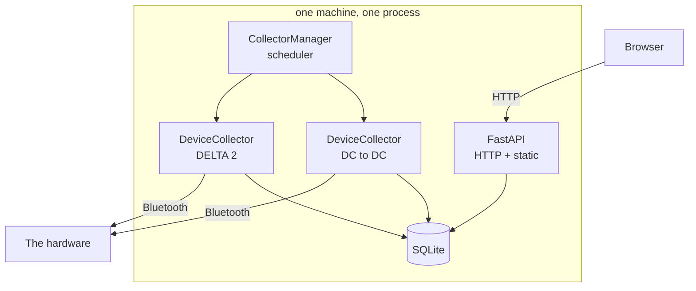
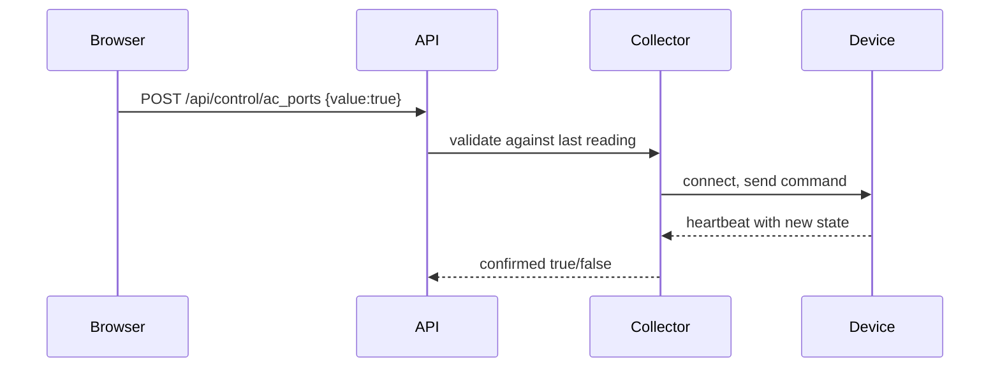

# Architecture

Written for a web developer. The web half of this app is ordinary; the Bluetooth half is
not, so each unfamiliar idea below is anchored to something you already know.

## What it is, in one paragraph

A FastAPI service that talks to two battery devices over Bluetooth, writes what they say
into SQLite, and serves a dashboard. There is no cloud, no message broker and no
background worker process. One Python process does everything, on one event loop.

## The shape



Two things run concurrently inside that process:

- a **background loop** that polls devices forever, and
- the **HTTP server** answering the browser.

They share memory directly. `collector.latest` is the same object the API returns. There
is no IPC, no queue and nothing to keep in sync.

## Two lifecycles

The HTTP one will look familiar:

```
GET /api/status -> require_login -> read collectors' in-memory state -> JSON
```

The collection one will not:

```
sleep -> pick a device that is due -> acquire the radio lock -> scan or reuse handle
      -> connect -> authenticate -> WAIT for the device to push data -> record -> disconnect
```

Note the **wait**. That step is the source of most of this system's complexity, and it
is explained next.

## Bluetooth, translated

| Bluetooth idea | The web thing it resembles | Where it differs |
| --- | --- | --- |
| Advertisement | mDNS / service discovery broadcast | Stops entirely while some devices are connected |
| GATT characteristic | An endpoint on a tiny API | Binary, fixed IDs, no discovery by name |
| Notification | Server-sent events | You cannot request a value; you subscribe and wait |
| Protobuf payload | JSON with a schema | Binary, and the schema was reverse-engineered by others |
| Pairing / auth | A login returning a session | Keyed on your EcoFlow user ID plus the device serial |

The critical difference is the third row. **You do not ask the battery for its voltage.**
You connect, and the device pushes "heartbeat" messages on its own schedule. Different
groups of fields ride different heartbeats, arriving at different rates.

That is why `_await_readings` exists: after connecting, the collector waits until one
representative field from each heartbeat family has arrived. An earlier version waited a
fixed 8 seconds instead, and the inverter heartbeat missed that window 42% of the time,
storing six AC fields as null.

The second critical difference: **only one connection at a time**, per device and in
practice per radio. This is closer to an exclusive database lock than to HTTP.

## The code map

| Module | Lines | Responsibility | Depends on |
| --- | --- | --- | --- |
| `config.py` | 69 | `.env` loading, `Settings`, where things live on disk | nothing |
| `models.py` | 168 | `Snapshot`, `AlternatorSnapshot`, `Control`, `DeviceKind` | nothing |
| `devices.py` | 111 | `DELTA2` and `ALTERNATOR`: all that differs between units | models |
| `storage.py` | 62 | `TelemetryStore`: table per kind, schema and migration generated | models |
| `collector.py` | 390 | The hard part: discovery, connect, wait, record, commands | config, models, storage |
| `manager.py` | 49 | Polls each device in turn, never in parallel | config, collector |
| `api.py` | 208 | Routes, and `create_app()` which wires everything | all of the above |
| `main.py` | 13 | Entry point: `uvicorn app.main:app` | api, config |

Dependencies run one way, top to bottom - no module imports one below it.

The front end is the same idea, in `static/js/`. The browser loads it as native ES
modules, so there is no bundler and no build step:

| Module | Responsibility |
| --- | --- |
| `format.js` | Pure formatters. No DOM, no network. |
| `api.js` | Every call to the server. |
| `store.js` | The small amount of shared mutable state, in one visible place. |
| `status.js` | Decisions: what the button says, what the battery message is. Pure. |
| `chart.js` | `chartScale` is the maths and is tested; `drawChart` is canvas glue. |
| `groups.js` | What each card shows, and how a row becomes a widget. |
| `views.js` | The DOM layer. Applies what `status.js` decided. |
| `main.js` | Wiring, polling, handlers. |

The split follows one rule: **decisions are pure and tested, the DOM layer is thin
glue.** `refreshButtonState` returns `{label, hint, disabled}` and `views.js` applies
it, so every button state is testable without a browser.

`create_app(settings, database_path)` takes its collaborators as arguments and hangs
them on `app.state`, so a test can build a complete, isolated application without
environment variables, a real database or a Bluetooth radio.

`DeviceKind` is the key abstraction. Adding a third device means adding a dataclass and
one `DeviceKind` entry; the table, the migration, the insert and the API all follow from
it. Nothing else branches on device type.

## Concurrency: one loop, one radio, one lock

Everything is `asyncio` on a single thread. If you have written Node, this is the same
model: no parallelism, just interleaving at every `await`.

- `radio_lock` is a single `asyncio.Lock` shared by **all** collectors, because the
  Bluetooth radio can hold one conversation at a time.
- `_in_flight` is per collector. It exists because the shared lock can no longer answer
  "is *this* device already being read?" - the lock may be held by the other device.
- Every operation under the lock is time-boxed (`COMMAND_TIMEOUT` 20s,
  `OPERATION_TIMEOUT` 120s). A Bluetooth write with no timeout once hung and froze both
  devices for eleven minutes, because the lock was never released.

**The rule worth carrying elsewhere:** anything that holds a shared resource must be
bounded, or one stuck call takes down everything that shares it.

## Data and storage

SQLite, one file, one table per device kind, 30-day retention.

The schema is generated from the dataclass, so the columns cannot drift from the code.
On startup `_add_missing_columns` adds any column the dataclass has and the table lacks -
a migration you never have to write.

Two rules the whole system depends on:

1. **A missing value is NULL, never 0.** The device not reporting something is different
   from it reporting zero watts, and the dashboard shows them differently.
2. **Derived values are computed, not trusted.** The DELTA 2 reports an extra battery
   attached when a charger is on that port, so `battery_N_attached` is derived from
   whether a pack actually reports a voltage.

## The control path

Writing follows the same lock, plus a read-back:



Validation happens twice: once against the last stored reading (instant rejection,
no radio) and once against the live device (authoritative). The read-back matters
because the property only changes when the *next* heartbeat arrives - reading it
immediately would return the old value and look like the command was ignored.

## Failure modes, and what handles each

| Failure | Symptom | Handling |
| --- | --- | --- |
| Device asleep or out of range | Scan finds nothing | Exponential backoff to 5 min |
| Phone app holds the charger | Device stops advertising entirely | Backoff; the error names the likely cause |
| Stale handle after system sleep | Connects and authenticates, sends nothing | Empty read drops the cache and rescans |
| Bluetooth write never acknowledged | Everything freezes | Timeouts release the lock |
| Heartbeat slower than the wait | Fields stored as null | Wait for data, not for the clock |
| Gateway machine off | No rows | Chart breaks the line; nothing is invented |
| Machine suspended | Handles go stale; a unit may stop advertising | Sleep overshoot detects the wake and drops every handle |

### Detecting a suspend

A sleeping process cannot notice it is asleep, so the wake has to be inferred. The
obvious method - comparing the monotonic and wall clocks, since the monotonic one is
supposed to stop during sleep - **does not work on macOS**: `time.monotonic()` is
`mach_absolute_time()`, which keeps counting. A measured 470-second clamshell sleep
produced zero divergence and went undetected.

What does work is the overshoot: a poll that asks to sleep 15 seconds and finds 470
seconds of wall time gone was not running for the difference. That is measured against
the requested interval, not between clocks.

## Known weaknesses

Honest list, in the order I would fix them:

1. **`Any` everywhere the device appears.** Unavoidable at the boundary, since the
   protocol library is loaded dynamically, but it leaks further in than it should.
   There is no type checker configured.
2. **`collector.py` is still 390 lines** and carries two responsibilities: finding and
   holding a connection, and reading and writing through it.
3. **The DOM layer is untested.** `views.js` and `groups.js` need a browser, so only
   the logic beneath them is covered.
4. **No CI.** `scripts/check.sh` runs everything, but only when someone remembers.

Fixed since first writing: the 951-line module is now the package above, importing it
no longer opens the live database, the module-level singletons are gone, and there are
47 tests.
